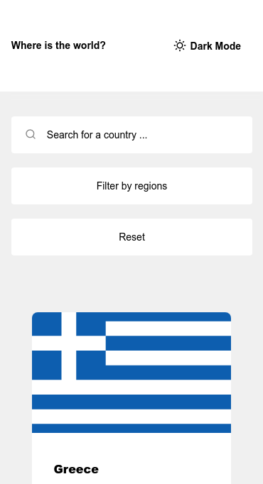
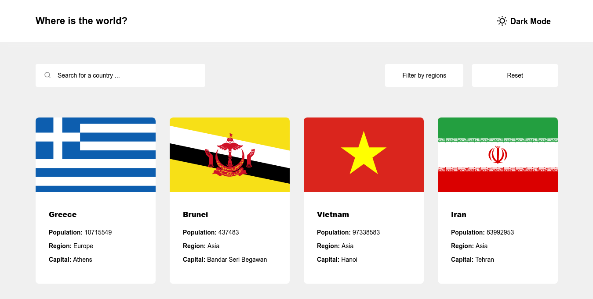
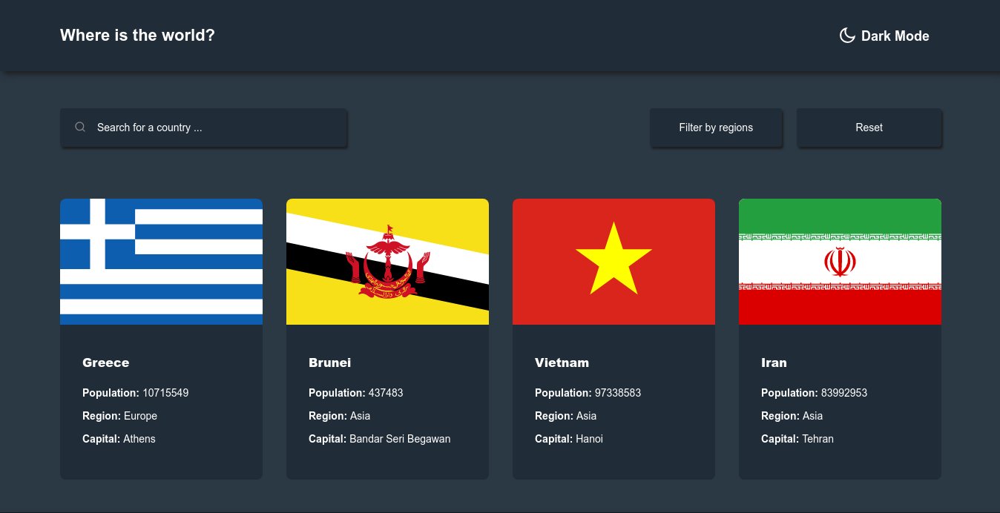
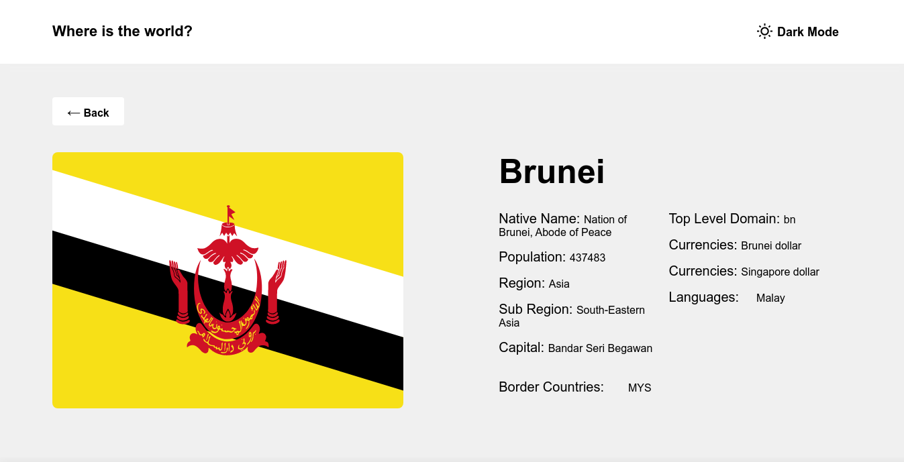

# **REST Countries**

<div align="center">
  <h2>
    <a href="https://github.com/Tanosimboangy/rest-countries-ts">
      Source
    </a>
    <span>|</span>
    <a href="https://jacquit-rest-countries.netlify.app">
      Demo
    </a>
  </h2>
</div>

## **Overview**





## **Built with**

- [React](https://reactjs.org/docs/getting-started.html)
- [Context API](https://reactjs.org/docs/context.html)
- [Typescript](https://www.typescriptlang.org/docs/)
- [Styled-components](https://styled-components.com/)

## **Features**

- A home page where a list of countries is displayed.
- Search for a specific country by name or region.
- See the country details by clicking on a country card.
- Switch between dark and light mode.

## **Getting started**

To clone and run this application, you will need [Git](https://git-scm.com) and [Node.js](https://nodejs.org/en/download/) (which comes with either [npm](http://npmjs.com) or [yarn](https://yarnpkg.com/)) installed on your computer. From your command line:

```bash
# Clone this repository
$ git clone https://github.com/Tanosimboangy/rest-countries-ts.git

# Install dependencies
$ npm install or yarn install

# Run the app
$ npm start or yarn start
```
